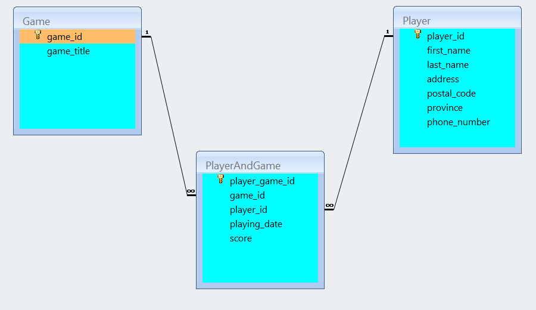
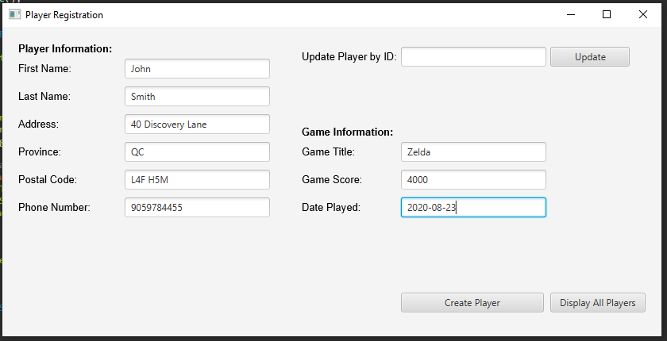
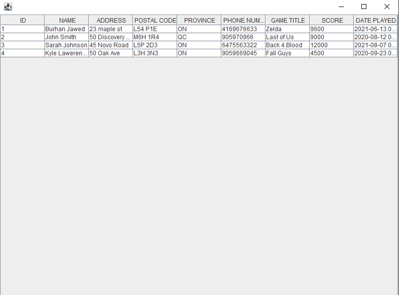
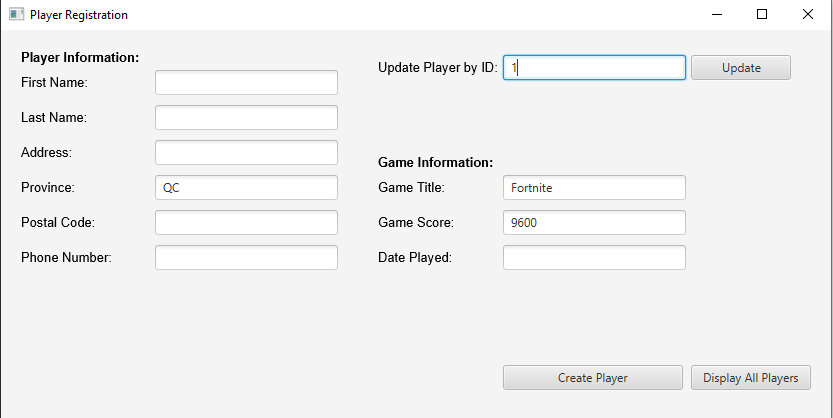

# LAB \#5 - Developing Database Applications using JDBC.

## Exercise 1

Develop a GUI Java application that will allow the players to submit
information about themselves and the games that they are playing
on-line. The information will be stored in a simple Oracle database. The
database tables are shown in the following picture:

You should populate the table *Game* with titles of games that you have
"played" during this semester.

Your GUI should provide the necessary SWING or JavaFX components that
will allow the user to enter and display the data. You will use JDBC to
provide the following operations:

1.  *Insert* game and player information into the database.

2.  *Update* the existing player information.

3.  *Display* reports with player and played games information. You may
    use a *JTable or other components to display the reports. Allow the
    user to select player_id*.

Use prepared statements to implement all database operations.

> (10 marks)

**Evaluation:**

<table>
<colgroup>
<col style="width: 50%" />
<col style="width: 49%" />
</colgroup>
<thead>
<tr class="header">
<th><strong>Functionality</strong></th>
<th></th>
</tr>
</thead>
<tbody>
<tr class="odd">
<td><blockquote>

Correct implementation of UI and event handling.

</blockquote></td>
<td>35%</td>
</tr>
<tr class="even">
<td><blockquote>

Correct implementation of JDBC

</blockquote></td>
<td>50%</td>
</tr>
<tr class="odd">
<td><blockquote>

Comments, correct naming of variables, methods, classes, etc.

</blockquote></td>
<td>5%</td>
</tr>
<tr class="even">
<td><strong>Friendly input/output</strong></td>
<td>10%</td>
</tr>
<tr class="odd">
<td><strong>Total</strong></td>
<td>100%</td>
</tr>
</tbody>
</table>

**The UI may look like the following:**

**\[IN YOUR APPLICATION DO NOT USE THE SAME DATA. USE YOUR FULL NAME AS
ONE OF THE PLAYERS.\]**

**Display All Players**

**Update Operation:**

**After Updating Display All Players:**

